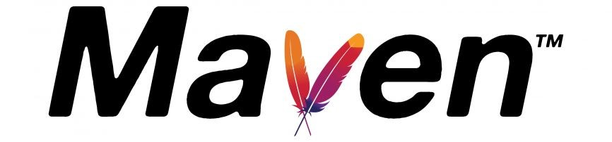

<h1 align="center"><b>Assalamu Alaikum , I'm Abdullah </b></h1>
 

##
 
 
<picture> </picture>

 

<picture></picture> **About me**

- I am a `Senior` at [Faculty of Engineering - Systems and Computers Department](https://eng-azhar.net/) at [Al-Azhar University](http://azhar.edu.eg/).
- I love using Software as a solution for every `Problem`.
- I am a competitive programmer at `Codeforces`, `Leetcode`, `Hackerrank`.
- I’m currently learning `Computer Science` and `Software Engineering`.
- Always `learning new things`.
- I’m currently open for an Intern or a new job opportunity

  

 

 
  

## <b> Skills</b>
### <picture>   </picture> Programming languages : 

 
  &emsp;
   
  &emsp;
  

### <picture>   </picture> Frontend Development : 

 
  &emsp; 
     
  &emsp;
   
  &emsp;
  

### <picture>   </picture> Backend Development : 

 
&emsp; 
    
  &emsp; 
    

 ### <picture>   </picture> Software & Tools : 
 

  &emsp;
    
  &emsp;
    
  &emsp;
  
  &emsp;
    
  &emsp;
    
    &emsp;
    
    &emsp;
    
    &emsp;
    
    &emsp;
    

 ### <picture>   </picture> IDEs : 
 

  &emsp;
    
  &emsp;
    
    &emsp;
    
    &emsp;
    
    &emsp;
    

 ### <picture>   </picture> Competitive Programming & Problem Solving : 
 

  &emsp;
    	
  &emsp;
    
  &emsp;
    

 

## <picture>   </picture> <b>My Github Status :</b>
 

 

 

 

  

  

## <picture>  </picture> Contact me via :  

	 
	
	
	

